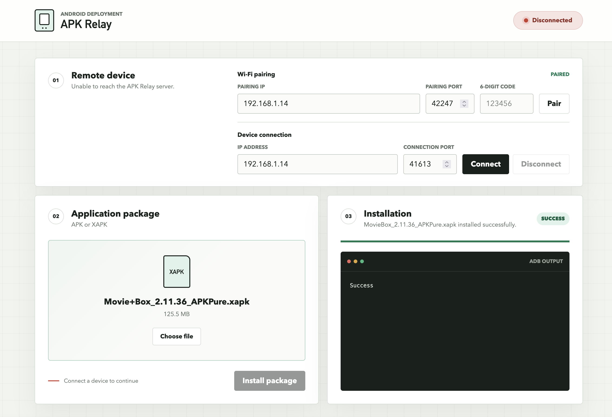

# APK Relay

APK Relay is a local Flask interface for connecting to an Android device over
ADB TCP/IP and installing an APK or XAPK. Uploads are queued for background
installation, and the interface reports the live connection and job result.

## Requirements

- Python 3.11 or newer
- Android Platform Tools (`adb` must be on `PATH`, or set `ADB_PATH`)
- An Android device with wireless debugging enabled

On Android 11 and newer, open **Developer options > Wireless debugging > Pair
device with pairing code**. Enter the displayed pairing IP, pairing port, and
six-digit code in the **Wi-Fi pairing** fields. APK Relay sends the pairing code
directly to ADB; it does not open a terminal.

Pairing establishes trust but does not connect the device. Return to the main
Wireless debugging screen and enter its separate IP address and connection port
in **Device connection**. The pairing and connection ports are usually
different.

The equivalent manual pairing command is:

```bash
adb pair DEVICE_IP:PAIRING_PORT PAIRING_CODE
```

## Run

```bash
python3 -m venv .venv
source .venv/bin/activate
python -m pip install -r requirements.txt
python run.py
```

Open <http://127.0.0.1:5000>. The server binds to localhost by default because
it can execute ADB operations. Do not expose it to an untrusted network without
adding authentication and HTTPS.

## Package behavior

- `.apk` files run through `adb -s SERIAL install -r FILE`.
- `.xapk` files are treated as ZIP archives. Their APK payloads are safely
  extracted and passed to `adb -s SERIAL install-multiple -r FILES`.
- Additional XAPK assets such as OBB files are not copied to the device.

## Test

```bash
python -m unittest discover -s tests -v
```


